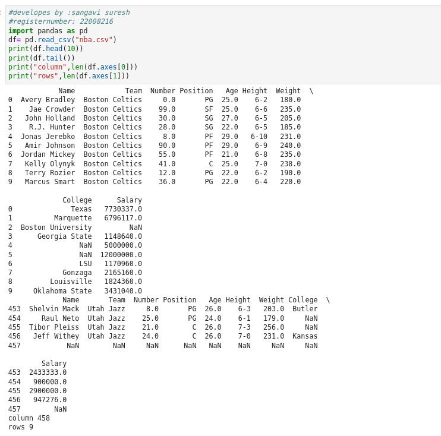

### AIM:

To write a python program for reading the csv file content.

### EQUIPEMENTS REQUIRED:

PC Anaconda - Python 3.7

### ALGORITH:

### STEP1:

Load the CSV into a DataFrame.

### STEP2:

Print the number of contents to be displayed using df.head().

### STEP3:

The number of rows returned is defined in Pandas option settings.

### STEP4:

Check your system's maximum column with the pd.options.display.max_column statement.

### STEP5:

Increase the maximum number of rows to display the entire DataFrame.

### PROGRAM:
``` PYTHON
DEVELOPED BY : sangavi suresh
REGISTER NUMBER : 22008216

import pandas as pd
df= pd.read_csv("nba.csv")
print(df.head(10))
print(df.tail())
print("column",len(df.axes[0]))
print("rows",len(df.axes[1]))
```
### OUTPUT:



### RESULT:
Thus the program is written to read the csv file.